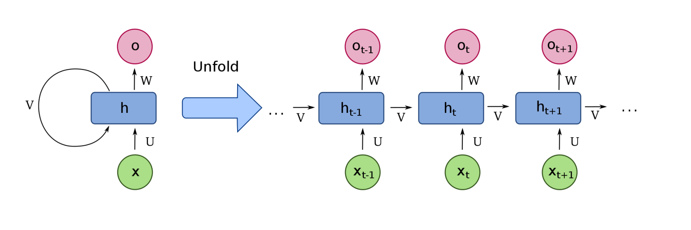

# qlib_RNN

### Task1

安装qlib并下载数据

- task1.ipynb为文件安装成功展示

---

### Task2

RNN的原理图为：



图分左右两边：左边给出的RNN是一个抽象的循环结构，右边是左边RNN展开以后的形式。先来看右边的结构，从下往上依次是序列数据的输入X（图中的绿色结构，可以是时间序列，也可以是文本序列等等）。对于t时刻的x经过一个线性变换（U是变换的权重），然后与t-1时刻经过线性变换V的h相加，再经过一个 非线性激活（一般使用tanh或者relu函数）以后，形成一个t时刻的中间状态h，然后再经过一个线性变换（W）输出o ，最后再经过一个非线性激活（可以是sigmoid函数或者softmax等函数）形成最后的输出y。

上面的文字描述，可以形式化表示为下面的公式：
$$
a^ {t} = Vh^ {t-1} + Ux^ {t} +b \\

h^ {t} = \tanh ( a^ {t} )\\

o^ {t} = Wh^ {t} +c\\

y^ {t} = sigmoid( o^ {t} )
$$


---

### Task3

将task2中的RNN模型构建一个完整的workflow配置示例。将`task3/pytorch_rnn.py`放在`qlib/contrib/model`目录下。

采用qrun + workflow，一句话启动策略运算。

```python
python 
```

