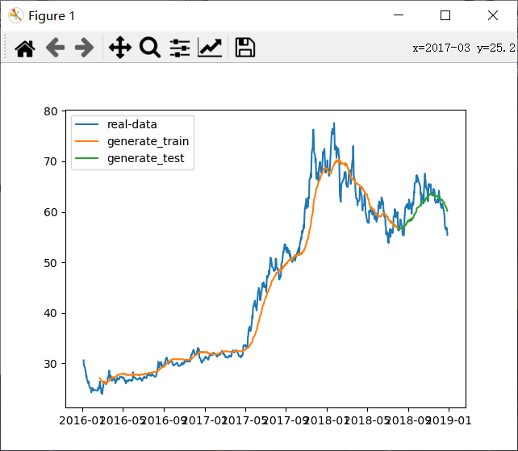

# qlib_RNN

### Task1

安装qlib并下载数据

- task1.ipynb为文件安装成功展示

---

### Task2

RNN的原理图为：


图分左右两边：左边给出的RNN是一个抽象的循环结构，右边是左边RNN展开以后的形式。先来看右边的结构，从下往上依次是序列数据的输入X（图中的绿色结构，可以是时间序列，也可以是文本序列等等）。对于t时刻的x经过一个线性变换（U是变换的权重），然后与t-1时刻经过线性变换V的h相加，再经过一个 非线性激活（一般使用tanh或者relu函数）以后，形成一个t时刻的中间状态h，然后再经过一个线性变换（W）输出o ，最后再经过一个非线性激活（可以是sigmoid函数或者softmax等函数）形成最后的输出y。

上面的文字描述，可以形式化表示为下面的公式：


RNN模型代码：

```python
class RNNModel(nn.Module):
    def __init__(self, d_feat=6, hidden_size=64, num_layers=3, dropout=0.0):
        super(RNNModel,self).__init__()

        self.input_size = d_feat
        self.hidden_size = hidden_size
        self.num_layers = num_layers
        self.dropout = dropout
        self.rnn = torch.nn.RNN(
            input_size=self.input_size, 
            hidden_size=self.hidden_size,
            num_layers=self.num_layers,
            batch_first=True,
            dropout=dropout,)

        for p in self.rnn.parameters():
          nn.init.normal_(p, mean=0.0, std=0.001)
        self.fc_out = nn.Linear(hidden_size, 1)


    def forward(self, x):
        x = x.reshape(len(x), self.input_size, -1)
        x = x.permute(0, 2, 1)
        out, _ = self.rnn(x)
        return self.fc_out(out[:, -1, :]).squeeze()
```

使用RNN模型，对`task2/stock_data.csv`中730条股票数据进行训练。运行：

```python
python task2/task2.py
```




---

### Task3

将task2中的RNN模型构建一个完整的workflow配置示例。将`task3/pytorch_rnn.py`放在`qlib/contrib/model`目录下。

采用qrun + workflow，一句话启动策略运算。

```python
python task3/workflow_config_rnn_Alpha360.yaml
```

在linux服务器上运行，因为n_epochs为200，截取部分运行结果如下：


